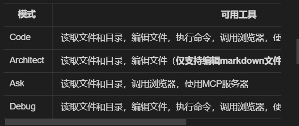
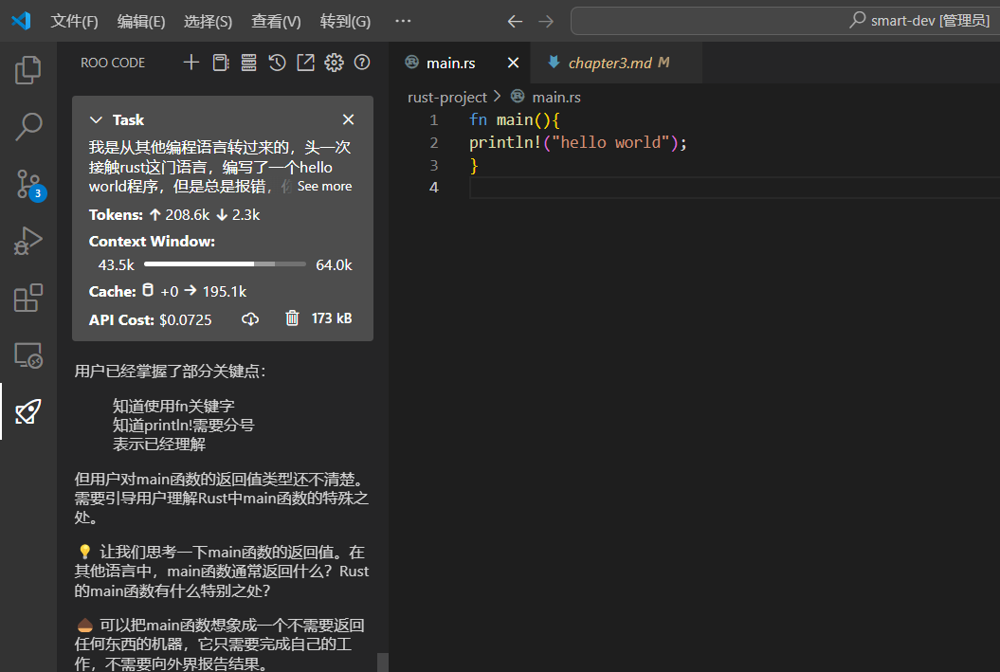
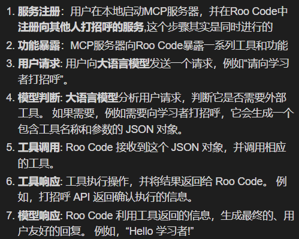

## chapter1

***环境下载、安装与配置***

* vscode下载与安装
* Roo Code下载与安装
* Roo Code配置deepseek

## **chapter2**

1. ROO CODE界面介绍

2. 自动审批功能介绍

   
3. Roo Code工作模式

   - 代码生成模式，也可以修复问题
   - 代码规划模式（Architect）规划技术方案，设计系统架构，提出优化建议。帮助用户思考需求，简化项目文档。
   - 代码解释模式（Ask）帮助用户理解代码含义，编程概念，技术实现的问题
   - 代码重构模式（Debug）调试
4. @的功能

   
5. 提示词增强功能

   - 不要使用推理模型，推理模型会将思维过程写入提示词，导致提示词很长，不利于Roo Code理解
6. 开发流程
7. 代码规划模式（Architect）需求分析，提示词增强，确定确定需求，进入code模式，代码生成，运行生成代码，调试，迭代优化，完毕
8. 需求分析-项目开发-迭代优化

## chapter3

提示词（Prompts）配置，提示词是Prompt，是用户向llm输入的一段文本，用于指导llm生成符合用户要求的输出。

> [插入链接，github](https://github.com/Xhseeker?tab=repositories)

> [跳转到目标文件](chapter3/chapter3.md)

llm回答的语言及自定义规则，不同模式下llm的提示词，支持性提示词

- 可以在项目中新建.clinerules文件，将项目要求、技术栈写入文件

- 若要将整个提示词迁移到其他编程工具中使用，可以点击下方“**Preview System Prompt**”按钮，将提示词复制到剪贴板中
- 支持性提示词
- 自定义有特定功能的提示词

## - 提示词smart-prompt

## chapter4

MCP（Model Context Protocol），允许Roo Code与本地运行的MCP服务器进行通信的协议

- 可以实现功能扩展，数据整合，自定义工具

  
- MCP服务实际上是一个遵循特定协议的服务器，它与Roo Code进行通信，提供各种功能接口。
- 了解基本的HTTP服务器概念
- MCP服务器

MCP服务都为AI辅助编程提供了无限可能。随着你对MCP服务的熟悉和深入理解，你将能够创建越来越强大的工具来增强你的AI编程体验。

[MCP官方项目](https://github.com/modelcontextprotocol/servers)

[MCP文档](https://modelcontextprotocol.io/introduction)

[精选MCP服务器](https://github.com/punkpeye/awesome-mcp-servers)
