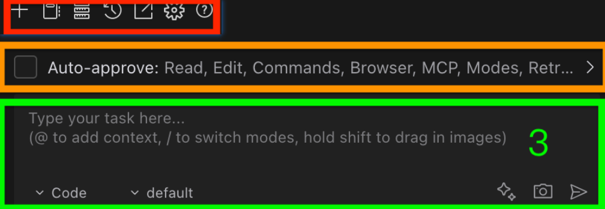
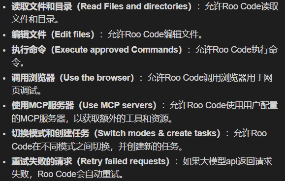
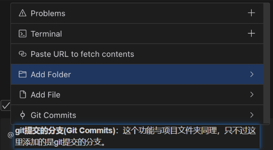

## chapter1

第1章 环境下载、安装与配置

* vscode下载与安装
* Roo Code下载与安装
* Roo Code配置deepseek

## **chapter2**

1. ROO CODE界面介绍

2. 自动审批功能介绍

   
3. Roo Code工作模式

   - 代码生成模式，也可以修复问题
   - 代码规划模式（Architect）规划技术方案，设计系统架构，提出优化建议。帮助用户思考需求，简历项目文档。
   - 代码解释模式（Ask）帮助用户理解代码含义，编程概念，技术实现的问题
   - 代码重构模式（Debug）调试
4. @的功能

   
5. 提示词增强功能

   - 不要使用推理模型，推理模型会将思维过程写入提示词，导致提示词很长，不利于Roo Code理解
6. 开发流程
7. 代码规划模式（Architect）需求分析，提示词增强，确定确定需求，进入code模式，代码生成，运行生成代码，调试，迭代优化，完毕
8. 需求分析-项目开发-迭代优化

## chapter3
